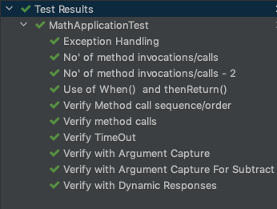

# Java-Testing: Mockito

## Overview

This submodule provides learners with an introduction to Mockito in Java Testing.

### Objectives

By the end of this submodule, the learners should be able to:

- Understand how to use Mockito for: 
  - Adding Test Behaviour
  - Verifying the expectation
  - Verifying Exceptions
  - Capturing Arguments and verify
  - Timeouts

## Materials and Resources

### Resources

- [Mockito Tutorial](https://site.mockito.org/)
- [Mockito Java Documentation](https://javadoc.io/doc/org.mockito/mockito-core/latest/org/mockito/Mockito.html)
- [Unit tests with Mockito](https://www.vogella.com/tutorials/Mockito/article.html)
- [Mockito Tutorial](https://javacodehouse.com/blog/mockito-tutorial/)

### Exercises

The following section describes standalone exercises to give to students. For each exercise, follow the instructions below to share with your class:

1. Clone the repository locally
1. Re-upload it into your class' GitHub organization. **Make sure there is no solution branch in the uploaded repo**.
1. Share the link to the exercise repository with students.

# Write the Mockito tests based on the given tasks. 

## Overview:
- In this exercise, you are going to write test cases using **Mockito**.  
- For the given MathApplication.java application there is an external service "Calculator.java" which does actual math calculations.
- As "Calculator.java" is an interface, we don't have implementation of Calculator functionalities.
- We are going to Mock the "Calculator.java" in order to verify the MapApplication.
- 
There blank tests methods are provided. Please add the appropriate Mockito functions in order to complete the below tasks. 

## Task 1 - Use of When()  and thenReturn()
Add CalcService call expectations to **testMathApplicationUsingWhen()** method using:
    
    when() and thenReturn() 

## Task 2 - Verify method calls
Add missing verifications to the test method: **testMathApplicationUsingVerify()** 

      By using verify() method, check each MathApplicaton method has been called.  

## Task 3 - No' of method invocations/calls
Add below verifications to the test method: **testVerifyNoOfMethodCalls()** to verify **calcService** calls:
Test case  | Method name | No'of method calls 
---       | ---         | ---
1         | add         | 3
2         | subtract    | 2
3         | divide      | 1
4         | multiply    | never

## Task 4 - No' of method invocations/calls
Add below verifications to the test method: **testVerifyNoOfMethodCalls2()** to verify **calcService** calls:

Test case  | Method name | No'of method calls 
--- | ---      | ---
1 | add | at most 3 times
2 | subtract | at least 2 times
3 | divide | at least once
4 | multiply | never

## Task 5 - Exception Handling
Add verifications to the method: **verify_ExceptionHandling()** to verify below cases:

 Test case  | Method name | Expected Exception | Expected Message
 --- | --- | ---  | --- 
 1 | add() | RuntimeException | Both Arguments can not be zero
 2 | subtract() | IllegalArgumentException | Invalid Arguments
 3 | divide() | ArithmeticException |Can not be divided by zero

## Task 6 - Verify Method call sequence/order
Add verifications to the method: **verify_OrderOfMethodExecution()** to verify below cases:

Test case  | Method name | Expected Exception | Expected Message
--- | --- | ---  | --- 
1 | add() | RuntimeException | Both Arguments can not be zero
2 | subtract() | IllegalArgumentException | Invalid Arguments
3 | divide() | ArithmeticException |Can not be divided by zero

When all the tests are passing, you should have an output similar to the one below:

 
